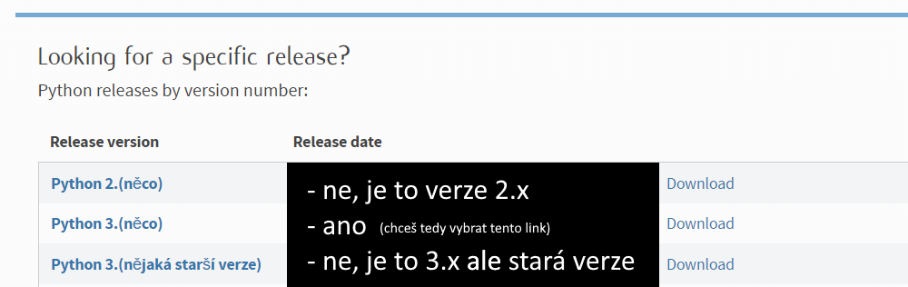
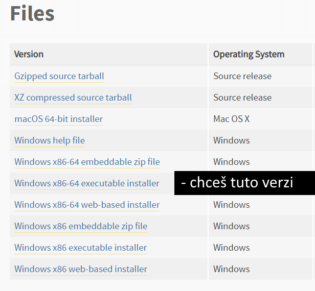
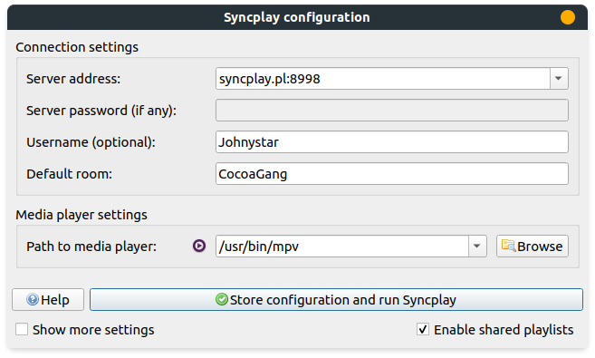

# mpv + youtube-dl

Pokud máš na systému nainstalované youtube-dl, mpv je schopné rozjet cokoliv s čím si youtube-dl poradí:

- YouTube (videa, kanály, playlisty, livestreamy, ..)
- Twitch (klipy, streamy, videa, ...)
- Reddit (posty)
- Vimeo (videa, alba, kanály, ...)
- Twitter (broadcasty, ...)
- [obrovskou hromadu dalších](https://ytdl-org.github.io/youtube-dl/supportedsites.html) (skoro až moc xd)

Na přehrávání online videí v mpv (což samozřejmě funguje i se Syncplayem) potřebuješ:

- mpv ([návod k instalaci zde](instalace-zaklad.md#mpv-funguje-se-syncplayem-nejlepe))
- youtube-dl (instalace popsána níže)

**Ano, instalace na Windowsu není triviální, ale** rozjede to ve výsledku skoro cokoliv. V případě problémů se obraťte na Johnystar.

[Jo a návod na následné použití potom najdeš úplně dole](#jak-pouzit-pro-sledovani-ve-vice-lidech)

## Instalace youtube-dl

**Poznámka**: youtube-dl je skvělá terminálová aplikace napsaná v Pythonu. mpv ji používá pro získávání videí a streamů z cílových stránek. Jako terminálová aplikace funguje velmi dobře a je rychlejší na stahování videí než webové stránky - pokud máš zájem tak tě rád naučím ji používat!

- [instalace na Windowsu](#windows)
- [instalace na Linuxu](#linux-debian-ubuntu-mint-elementary-popos)

### Windows

Link na stránku s Pythonem: <https://www.python.org/downloads/>. Zaskroluj úplně dolů dokud nenajdeš tohle:

Jakmile vybereš tu správnou verzi a klikneš na ní (v případě obrázku klikneš na text "Python 3.(něco)"), tak zaskroluj dolů dokud nenajdeš tohle:

Tak jak je na obrázku naznačeno, chceš vybrat verzi "Windows x86-64 executable installer".

- instalace:
	- customize installation
	- pip ANO
	- for all users ANO
	- next
	- add Python to environment variables ANO
	- precompile standard library ANO
	- neměň cestu instalace!
	- install
- ve Start menu vyhledej CMD, klikni pravým a otevří jako správce/administrátor
- do CMD zadej:
	- ``python -m pip install -U youtube-dl``

### Linux - Debian (Ubuntu, Mint, Elementary, Pop!os, ...)

- v terminálu:
	- ``sudo apt get update && sudo apt get upgrade && sudo apt install -y python3 python3-pip ffmpeg``
	- ``python3 -m pip install -U youtube-dl``

## Jak použít pro sledování ve více lidech

Normálně když chceš pustit přes Syncplay video za pomocí mpv:

- zapneš Syncplay a připojíš se na Syncplay room
- do mpv přesuneš soubor

Online videa se pouští podobně (je více způsobů, ale tento je noob-friendly, jednoduchý na pochopení a i na popsání):

- zapneš Syncplay a připojíš se na Syncplay room
- (najdeš si URL videa, playlistu, streamu, ... na který se chceš podívat)
- přesuneš URL (text) do mpv (buď přímo z URL baru prolížeče a nebo například z textového editoru - označíš a přetáhneš do mpv)
	- **ANO, DOSLOVA PŘESUNEŠ**
	- úplně stejně jako když chceš přesunout soubor
	- označíš a táhneš myší dokud to není nad mpv a potom pustíš
	- nehledej v tom žádné složitosti

### Jak použít pro sledování v jednom

Zcela stejně, akorát místo Syncplaye přímo zapneš mpv.

### Poznámka

Ověř si že máš v Syncplayi nastavený mpv místo VLC. Viz "Path to media player:" nastavení dole.

**Tohle nastavení funguje na mé instalaci Linuxu! Na tvé instalaci (potenciálně i jiného operačního sytému - třeba Windowsu) bude cesta k mpv jiná!**

