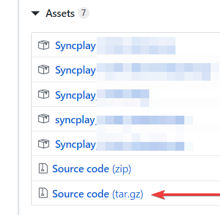

# Instalace

Pro účast jednoho z promítání Cocoa Gang Cinema potřebuješ:

- [Syncplay](#syncplay)
- [kompatibilní mediální přehravač](#kompatibilni-multimedialni-prehravace)

## Syncplay

### Windows

- [Stáhneš zde](https://syncplay.pl/) (vpravo vybereš Download Syncplay - verze u které není napsané BETA ani nic podobného a potom stáhneš installer a nainstaluješ)

### Linux - Debian (Ubuntu, Mint, Elementary, Pop!os, ...)

(technická poznámka: ačkoliv tento způsob není příliš noob-friendly, syncplay není v základních apt repositories a snap verze blbne/nefunguje/není stabilní)

- [stáhni první Source code tar.gz](https://github.com/Syncplay/syncplay/releases) (budeš muset trochu zaskrolovat než to najdeš pravděpodobně)

- extrahuj
- otevři terminál v extrahované složce:
	- ``sudo apt get update && sudo apt get upgrade && sudo apt install -y python3 python3-pip python3-twisted python3-pyside2.qtwidgets python3-certifi git make``
	- ``python3 -m pip install -U pyopenssl service_identity idna``
	- ``sudo make install``

## Kompatibilní multimediální přehravače

- [mpv](instalace-zaklad-mpv.md) - funguje se Syncplayem nejlépe
- [VLC](instalace-zaklad-vlc.md) - univerzální alternativa

### Jiné

Pokud jen trochu možné tak **silně nedoporučuji** používat nic jiného než VLC nebo mpv (s tím že mpv funguje nejlépe, akorát má na Windowsu lehce komplikovanější, ačokliv stále jednoduchou, instalaci).

Na stránce Syncplay si lze najít že podporuje také MPC-HC a MPC-BE, oba tyto přehravače mají ovšem různé nevýhody oproti VLC i mpv.
